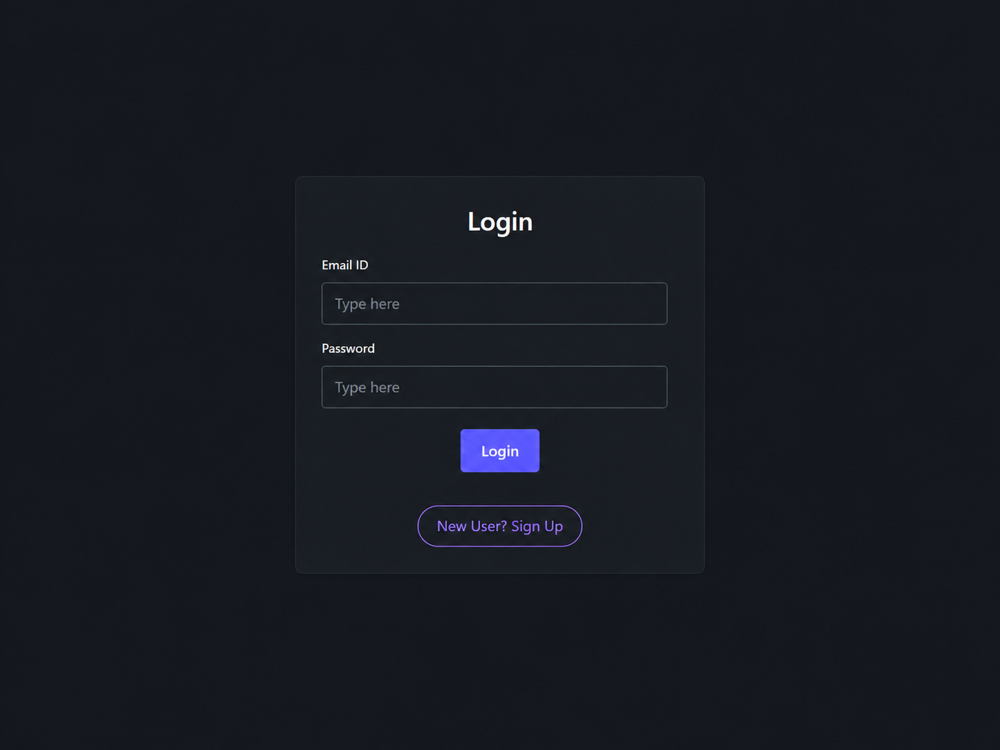
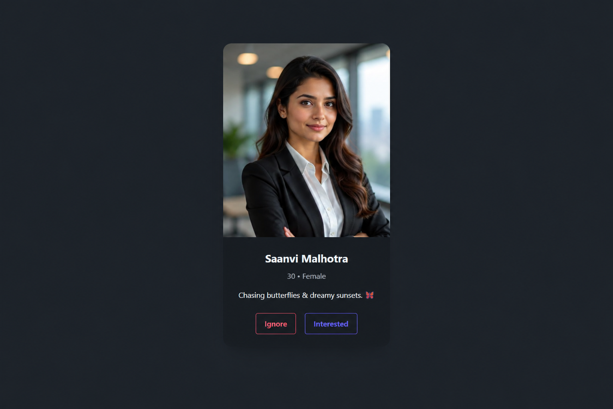
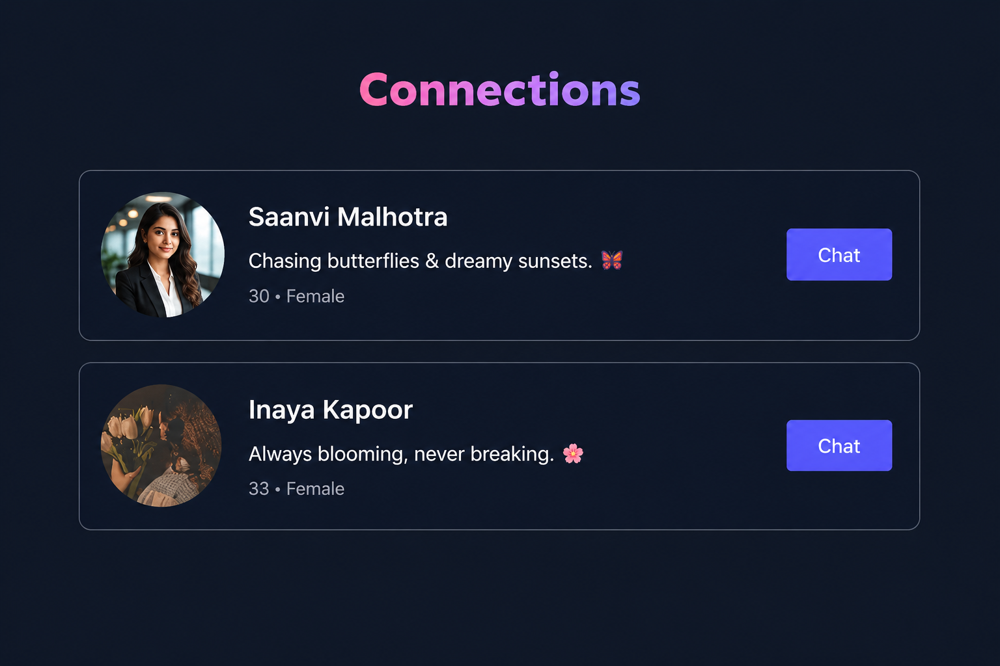
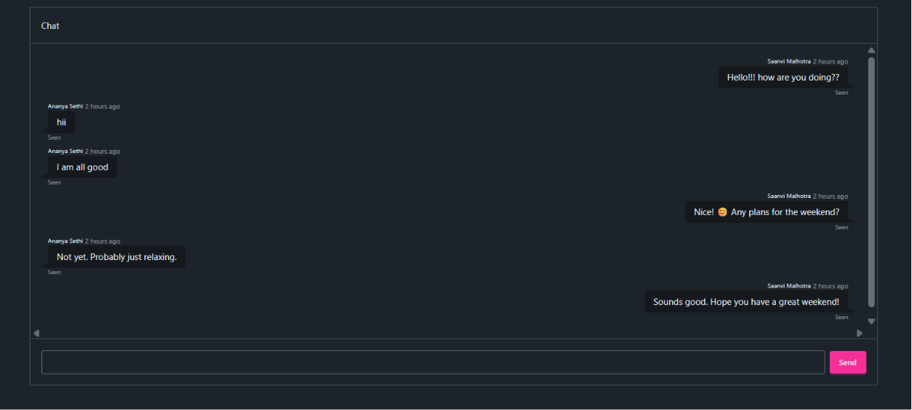

# Pair-Up Frontend

Frontend for **Pair-Up** — a developer networking app to discover people, send connection requests, accept matches, and chat in real time.

**Backend:** [Pair-Up Backend](https://github.com/Taman-07/DevTinder)

---

## Preview

| Login                                         | Discover Feed                               |
| --------------------------------------------- | ------------------------------------------- |
|  |  |

| Connections                                               | Real-time Chat                              |
| --------------------------------------------------------- | ------------------------------------------- |
|  |  |

---

## Features

* Sign up and login with cookie-based authentication
* Swipe-style feed to discover new developer profiles
* Send **Interested** or **Ignore** on user cards
* Auto-load the next feed batch without refreshing
* View and respond to incoming connection requests
* Browse accepted connections
* Real-time 1:1 chat with Socket.IO
* Edit your profile (name, age, gender, about, photo)

---

## Tech Stack

| Layer     | Tools                   |
| --------- | ----------------------- |
| UI        | React 19, Vite          |
| State     | Redux Toolkit           |
| Routing   | React Router            |
| HTTP      | Axios                   |
| Real-time | Socket.IO Client        |
| Styling   | Tailwind CSS 4, DaisyUI |

---

## Project Structure

```text
src/
├── App.jsx
├── components/
│   ├── Feed.jsx
│   ├── UserCard.jsx
│   ├── Login.jsx
│   ├── Profile.jsx
│   ├── Requests.jsx
│   ├── Connections.jsx
│   ├── Chat.jsx
│   └── Navbar.jsx
└── utils/
    ├── appStore.js
    ├── constants.js
    ├── socket.js
    ├── userSlice.js
    ├── feedSlice.js
    └── requestSlice.js
```

---

## Getting Started

### Prerequisites

* Node.js 18+
* **Pair-Up Backend** running on port **3000**

### Installation

```bash
git clone https://github.com/Taman-07/DevTinder_frontend

cd DevTinder_frontend

npm install
```

---

## Run

```bash
npm run dev
```

Open:

```text
http://localhost:5173
```

---

## Build

```bash
npm run build

npm run preview
```

---

## Routes

| Path                  | Page                         |
| --------------------- | ---------------------------- |
| `/`                   | Discover Feed                |
| `/login`              | Login / Sign Up              |
| `/profile`            | Your Profile                 |
| `/requests`           | Incoming Connection Requests |
| `/connections`        | Accepted Connections         |
| `/chat/:targetUserId` | Chat with a Connection       |

---

## How It Works

1. **Feed** — Browse developer profiles one at a time. Click **Interested** or **Ignore** to move to the next profile. When the current batch is exhausted, the next batch loads automatically.

2. **Requests** — Accept or reject incoming **Interested** requests.

3. **Connections** — Accepted matches appear on the **Connections** page.

4. **Chat** — Open a connection to start a real-time conversation using Socket.IO.

---

## Scripts

| Command           | Description                   |
| ----------------- | ----------------------------- |
| `npm run dev`     | Start Vite development server |
| `npm run build`   | Create a production build     |
| `npm run preview` | Preview the production build  |
| `npm run lint`    | Run ESLint                    |

---

## Author

**Tamanjot Kaur**

---
